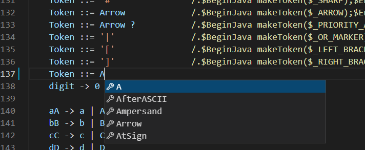
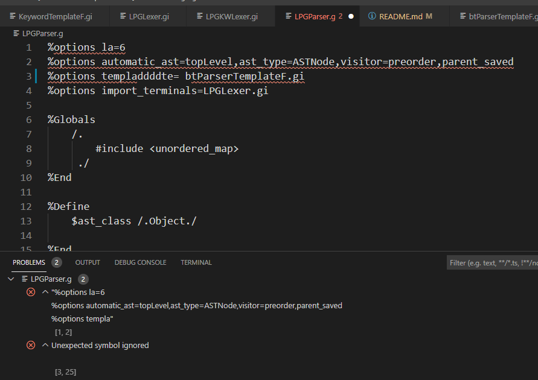
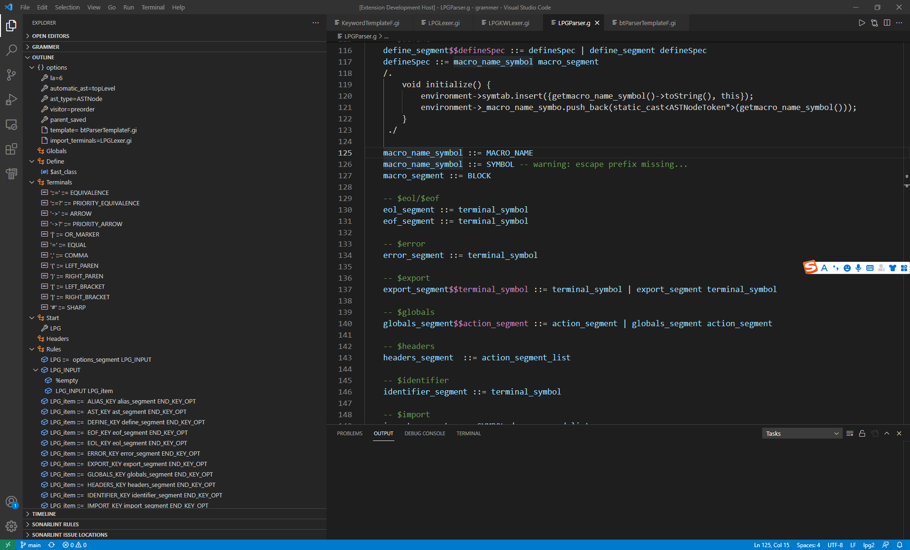
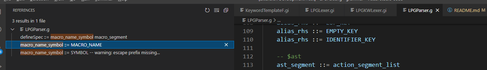

# LPG-language-server

## About LPG-cpp-runtime
C++ runtime for LPG 2.0. This project is a c++ target for LPG2.0
* [LPG-cpp-runtime](https://github.com/kuafuwang/LPG-cpp-runtime)

## Getting Started with LPG

[Getting Started with LPG]( https://github.com/kuafuwang/LPG-cpp-runtime/tree/main/lpg-generator-templates-2.1.00/docs )

## About LPG
The LALR parser generator ([LPG]( https://sourceforge.net/projects/lpg )) is a tool for developing scanners and parsers written in Java, C++ or C. Input is specified by BNF rules. LPG supports backtracking (to resolve ambiguity), automatic AST generation and grammar inheritance.